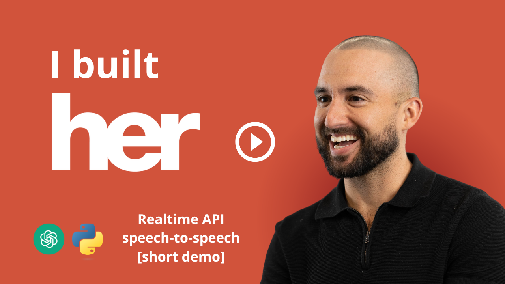

# AlitaOS — Your AI Live Assistant

AlitaOS is a streamlined, voice‑first AI assistant built with Streamlit and the OpenAI API. It features a true Realtime WebRTC integration for sub‑second, bi‑directional audio: speak naturally and Alita speaks back. A live transcript and animated avatar complete the hands‑free experience.

Highlights
- Realtime voice in/out via OpenAI Realtime (WebRTC) — minimal latency, no polling
- Live transcript panel for both your speech and Alita’s responses
- Animated avatar that “speaks” when audio plays
- Simple, clean Streamlit UI; HTTPS launchers for consistent mic support
- Single API dependency: OpenAI

Requirements
- Python 3.10+
- OpenAI API key in a `.env` at project root:
  ```env
  OPENAI_API_KEY=sk-...
  ```
- macOS/Linux: OpenSSL (usually preinstalled); Windows: OpenSSL on PATH for HTTPS launcher

Install
1) Create venv and install deps automatically via the launchers. Or manually:
   ```bash
   python3 -m venv alitaOS
   source alitaOS/bin/activate
   pip install -r requirements.txt
   ```

Launch (HTTP, fast local dev)
```bash
./launch_streamlit.sh
```
Open http://localhost:8501 and choose “🎧 Live Assistant”. Click Start and grant mic permissions.

Launch (HTTPS, recommended for mic reliability)
```bash
./launch_streamlit_https.sh
```
This auto‑generates a self‑signed cert and serves Streamlit at https://localhost:8501. Accept the browser warning once. The realtime proxy also runs with TLS at https://localhost:8787.

Windows Launchers
- HTTP: `launch_streamlit.bat` (starts Streamlit + realtime proxy)
- HTTPS: `launch_streamlit_https.bat` (generates certs, starts Streamlit HTTPS + realtime proxy TLS)

Environment Variables
- `OPENAI_API_KEY` — required
- `OPENAI_REALTIME_MODEL` — default: `gpt-4o-realtime-preview-2024-12-17`
- `ALITA_REALTIME_PORT` — default: `8787`

Project Structure
```
app/
  alita_streamlit.py      # Streamlit UI
  realtime_proxy.py       # FastAPI SDP proxy for OpenAI Realtime
  static/
    alita.jpg            # (optional) avatar image used in UI
tools/                    # image, search, stock, chart, python_file
utils/                    # ai_models.py (OpenAI only)
```

Avatar (Speaking Animation)
- Place your avatar image at `app/static/alita.jpg` (JPEG recommended). The UI animates a glow around the avatar when Alita is speaking, driven by a WebAudio analyser on the incoming audio stream.
- If the file is missing, a placeholder is shown.

Live Transcript
The “🎧 Live Assistant” panel shows a rolling transcript. It attempts to parse Realtime events over a data channel; content may vary by model version. We’ll keep iterating to improve robustness as OpenAI’s event schema evolves.

Troubleshooting
- No mic prompt or errors about getUserMedia: use the HTTPS launcher and ensure you granted microphone permissions to https://localhost:8501.
- Proxy errors (SDP exchange failed): confirm `.env` has a valid `OPENAI_API_KEY` and the proxy is running at http(s)://localhost:8787.
- No audio output: check system output device and browser autoplay policy; speak a word to “unlock” audio. Try clicking Start again.
- Windows HTTPS: ensure `openssl.exe` is on PATH (e.g., via Git for Windows or OpenSSL install). Otherwise use the HTTP launcher.

License
MIT
<p align="center">
   <a href="https://fokkemars.com/os1">
    
  </a>
  <br>
  <em>AlitaOS loading animation</em>
</p>

AlitaOS is a simplified conversational AI assistant built with Streamlit and OpenAI. It focuses on core functionality with a streamlined set of tools:

- **Voice Input**: Record audio and transcribe with OpenAI Whisper
- **Image Generation**: Create images using OpenAI DALL-E 3
- **Information Search**: Get comprehensive information using OpenAI's knowledge base
- **Stock Data**: Query stock prices and financial information
- **Data Visualization**: Create charts and graphs with Plotly
- **Python Code**: Create and execute Python scripts

## Quick Start

### 🚀 Easy Launch (Recommended)

1. **Clone and Setup**
   ```bash
   git clone <repository-url>
   cd alitaOS-main
   ```

2. **Create Environment File**
   Create a `.env` file in the root directory:
   ```
   OPENAI_API_KEY=your_openai_api_key_here
   ```

3. **Install Dependencies**
   - macOS/Linux: `bash ./install_mac_linux.sh`
   - Windows: `install_windows.bat`

4. **Launch AlitaOS (Streamlit)**
   - macOS/Linux: `bash ./launch_streamlit.sh`
   - Windows: `launch_streamlit.bat`

4. **Test Functionality** (Optional)
   ```bash
   ./run_tests.sh
   ```

### 📱 Access AlitaOS
- Streamlit app: http://localhost:8501

### 🎙️ Voice Feature Notes

- Grant microphone permissions when prompted by your browser.
- Chrome/Edge have best compatibility for audio capture in Streamlit.
- If transcription fails, ensure your `OPENAI_API_KEY` is set and that your audio input device is working.

## YouTube Demo
Watch a 2-minute demonstration of AlitaOS in action, where I showcase real-time voice interactions and various capabilities of the AI assistant.

<p align="center">
  <a href="https://www.youtube.com/watch?v=qVstKgrwX_o">
    
  </a>
  <br>
  <em>👆 Click the image to watch the demo on YouTube</em>
</p>


## Setup and Running

You can run AlitaOS using the provided install and launch scripts. Ensure your `.env` contains `OPENAI_API_KEY`.

### Option: Manual Setup

1. Create and activate a venv named `alitaOS` and install requirements:
   ```sh
   python3 -m venv alitaOS
   source alitaOS/bin/activate  # Windows: alitaOS\Scripts\activate
   pip install -r requirements.txt
   ```

2. Create `.env` with your key:
   ```
   OPENAI_API_KEY=your_openai_api_key_here
   ```

3. Launch Streamlit app:
   ```sh
   bash ./launch_streamlit.sh
   ```

### Option 2: Using Docker Compose

1. **Environment Variables**
   - Create a `.env` file in the root directory by copying `.env.example` and updating it with your own keys.

2. **Build and Run with Docker Compose**
   - Make sure Docker and Docker Compose are installed.
   - Run the following command:
     ```sh
     docker-compose up --d
     ```

## Tools and Features

Core tools currently supported in Streamlit:

- Stock price queries (yfinance)
- Plotly charts
- Image generation (OpenAI DALL-E)
- Information search (OpenAI)
- Python script generation and execution
- Voice input with Whisper transcription
